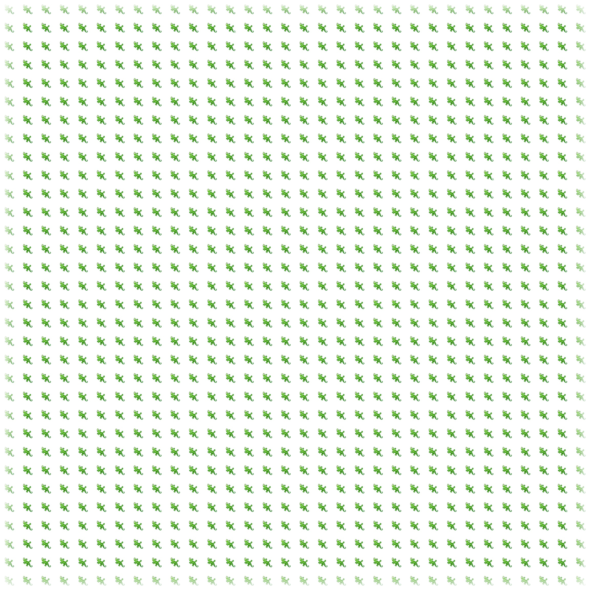

# Development Journal

Recording notes and thoughts on further developments here, in the format of a research log/journal. More or less, 
one-entry per day of significant development work.

### 09/13/20

Ready to run the first experiment using yesterdays implementation. Results TBD.

### 09/12/20

Began this days work fixing errors in my first attempt at implementing the multi-image trainer. I found that conversion
of a large list of tensors to a `np.ndarray` in `SamplePool` created an enormous bottle-neck. Once resolved, there were
a few simple errors to deal with, as well as one where some of the gradients have `NoneType`. I opted to just handle the
`NoneType` gradients in the code where this broke (`train_step` in multi-image trainer), but I am curious about the implication.
My guess is this is expected for some of the components in the model I added, but not in the original design, though I am
not sure.

### Prior to 09/12/20:

Starting this journal after significant development work. The first goal of this project was to 
 replicate the results of [Growing Neural Cellular Automata](https://distill.pub/2020/growing-ca/) in my
 own code, in order to fully understand all the structural pieces of the original experiment and how
 they can be modified. This was originally intended as a translation to PyTorch in an effort to better understand both
 libraries, but some of the features used here (`tf.GradientTape` in particular) had no obvious (to me) analogues at the 
 time.

In addition to the learning's in the Tensorflow library, there have a few significant ones for differentiable computing
 in general:
 - a better understanding of the basic convolutional elements, filters, and kernels.
 - understanding of the 1 x 1 convolution and its value (essentially a per pixel/x-y plane linear layer with shared 
 weights)
Since then, the goal was replication in Tensorflow, which was achieved for both experiments 1 & 2!

From here on out, the goal has been new tweaks and experimentation.

The first goal is to now grow an arbitrary image. One issue(?) in the analogy between the original experiments
CA and regular cellular development is that the weights of the update rule must also contain the knowledge of 
the organisms final shape, from the start. 

One question is: Can we separate the component which understands the image to provide a more useful representation to the
update rule? If so, this would imply there is more information about an image (or at least a better representation for 
it) than the image itself. At the risk of over-extending the biological analogy, this might make sense: genes and other 
functions along the DNA sequence are placed at the convenience of the machinery which constructs the organism, not at the
convenience of a reader who only wants to know what it will look like in the end.

I begin to experiment with this question with `multi_img*` models and trainers, loading a new image with each training 
run (though including repeats). Some risks to contend with:

1. How can we ensure we aren't just memorizing multiple images, instead of one? Maybe we train both portions on some small,
hopefully representative image set. After convergence, we can look at the success of a model training only the image loader
portion. It is ok/expected for the image loader to memorize images, as it has no knowledge of any board state. Could we 
then adapt to mutations in the update rule?

